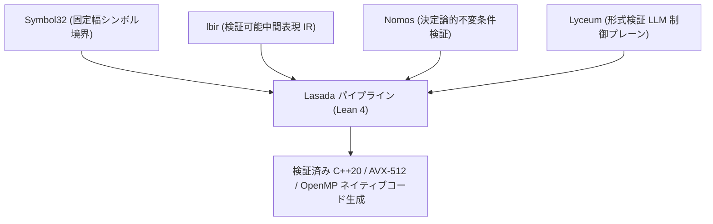

# Lasada 全体アーキテクチャ設計書 (ARCH_LASADA_SYSTEM.md)

## 1. システム概要
`Lasada` は、アジア言語（特に日本語・CJKV・ベトナム語）のトークン効率爆発を解消し、Gemma 4 などの大規模型から知能を移植・日本基準のアライメントを付与したドメイン未専門化ローカル基盤LLMを構築・駆動するための形式検証済みシステムである。

以下の4つの基盤ライブラリ・フレームワークをフルスタックで統合管理する。

---

## 2. 統合基盤コンポーネント

| コンポーネント | 責務 | 関連 Lean モジュール |
| :--- | :--- | :--- |
| **`Symbol32`** | 4bit/32bit 固定幅シンボル空間管理、文字コードパースの境界分断排除 | `Lasada.Tokenizer` |
| **`lbir`** | Lean 4 上での中間表現（LBIR）パケット（識別子 `0x341`, `0x342`）生成およびバイトコード変換 | `Lasada.CodeGen` |
| **`nomos`** | トークナイザ境界不変条件 (`Nomos.Contract`) および蒸留損失減衰法則 (`Nomos.Laws`) の証明 | `Lasada.Tokenizer`, `Lasada.DistillHB` |
| **`Lyceum`** | 推論コンテキスト (`MemoryMappedContext`) および MCP (Model Context Protocol) 統合 | `Lasada.DistillWB`, `Lasada.CodeGen` |

---

## 3. レイヤー別構築パイプライン

### Phase 1: アジア優先トークナイザ (Asian-Priority Tokenizer)
- 英語中心の BPE の欠陥を排除し、日本語（ひらがな/カタカナ/常用漢字）および CJKV/ベトナム語の初期語彙空間を予約。
- マージ重み計算時に言語別バイアス（日本語 ×10, CJKV ×5, アジア ×2, 欧州 ×1）を適用。

### Phase 2: Gemma 4 ホワイトボックス射影蒸留 (WB Projection Distillation)
- Gemma 4 (E4B / 31B) の高次元隠れ状態（$H_1 = 3584 / 8192$）を低ランク潜在空間（$L = 256$）へ射影し、生徒モデル隠れ状態（$H_2 = 2048$）へ同期。
- FLOPS コスト $O(V_{\text{teacher}} \cdot L + L \cdot V_{\text{student}})$ での転写。

### Phase 3: 日本語半ブラックボックスアライメント (HB Alignment)
- 日本語特化高アライメントモデルからの Soft-label (Top-K=20) 転写および DPO (Direct Preference Optimization) による価値観矯正。

---

## 4. 品質保証規約
- すべてのパイプラインモジュールは Lean 4 型システムおよび `Nomos` 不変条件テストを通過しなければならず、静的型エラーが存在する状態でのコード生成は禁止される。
