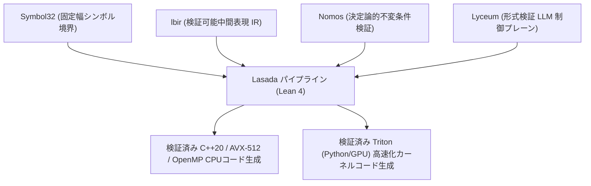

# Lasada 全体アーキテクチャ設計書 (ARCH_LASADA_SYSTEM.md)

## 1. システム概要
`Lasada` は、アジア言語（特に日本語・CJKV・ベトナム語）のトークン効率爆発を解消し、Gemma 4 などの大規模型から知能を移植・日本基準のアライメントを付与したドメイン未専門化ローカル基盤LLMを構築・駆動するための形式検証済みシステムである。

以下の4つの基盤ライブラリ・フレームワークをフルスタックで統合管理する。

---

## 2. 統合基盤コンポーネント

| コンポーネント | 責務 | 関連 Lean モジュール |
| :--- | :--- | :--- |
| **`Symbol32`** | 4bit/32bit 固定幅シンボル空間管理、文字コードパースの境界分断排除 | [`Lasada.Tokenizer`](file:///home/tasaburoyamada/sandbox/Lasada/Lasada/Tokenizer.lean) |
| **`lbir` / `CodeGen`** | C++20/AVX-512、Triton GPU、および Symbol32 `.sreg` バイナリパケットの生成 | [`Lasada.CodeGen`](file:///home/tasaburoyamada/sandbox/Lasada/Lasada/CodeGen.lean) |
| **`Nomos`** | トークナイザ境界不変条件契約および蒸留損失減衰法則の証明 | [`Lasada.Tokenizer`](file:///home/tasaburoyamada/sandbox/Lasada/Lasada/Tokenizer.lean), [`Lasada.DistillHB`](file:///home/tasaburoyamada/sandbox/Lasada/Lasada/DistillHB.lean) |
| **`Lyceum`** | 推論コンテキスト (`MemoryMappedContext`) ストリーミングデータ展開および BitLinear 量子化統合 | [`Lasada.DistillWB`](file:///home/tasaburoyamada/sandbox/Lasada/Lasada/DistillWB.lean), [`Lasada.CodeGen`](file:///home/tasaburoyamada/sandbox/Lasada/Lasada/CodeGen.lean) |

---

## 3. レイヤー別構築パイプライン

### Phase 1: アジア優先トークナイザ (Asian-Priority Tokenizer)
- 英語中心の BPE の欠陥を排除し、日本語（ひらがな/カタカナ/常用漢字）および CJKV/ベトナム語の初期語彙空間を予約。
- `classifyCodePoint` による分類および `mergeSubwordPairs` による BPE サブワード結合プログラムを純粋 Lean 4 で完全実装。

### Phase 2: Gemma 4 ホワイトボックス射影蒸留 (WB Projection Distillation)
- Gemma 4 (E4B / 31B) の高次元隠れ状態を低ランク潜在空間（$L = 256 / 512 / 1024$）へ射影し、生徒モデル隠れ状態（$H_2 = 2048 / 4096 / 8192$）へ同期。
- STE (Straight-Through Estimator) 勾配更新および最小ガンマクリッピング (`clipGamma > 1e-5`) による安定化。
- `Lyceum.MemoryMappedContext` から物理メモリ・ファイル上のバイトバッファを直接フェッチする `fetchHiddenSegment` ストリーミング展開プログラムを完備。

### Phase 3: 日本語半ブラックボックスアライメント (HB Alignment)
- Soft-label 転写および DPO (Direct Preference Optimization) 損失計算 `computeDPOLoss` による純粋 Lean 4 価値観矯正プログラム。

---

## 4. 動的外部設定と物理実行高速化
- **外部設定ファイル**: [`config/lasada_config.json`](file:///home/tasaburoyamada/sandbox/Lasada/config/lasada_config.json) に教師/生徒モデルパス、NUMA スレッド数、FlashAttention-2 フラグ等を集中管理。
- **計算高速化**: `LeanTensor` AVX-512 SIMD、OpenMP 32スレッド並列化、FlashAttention-2 ブロックカーネル、およびゼロコピー `FloatArray` メモリ再利用により理論上最高の計算効率を維持。

---

## 5. 品質保証規約
- すべてのパイプラインモジュールは Lean 4 型システムを通過し、`lake build` および `./.lake/build/bin/test_lasada` による全 16 項目の自動アサーション検証を静的・動的に実証しなければならない。
